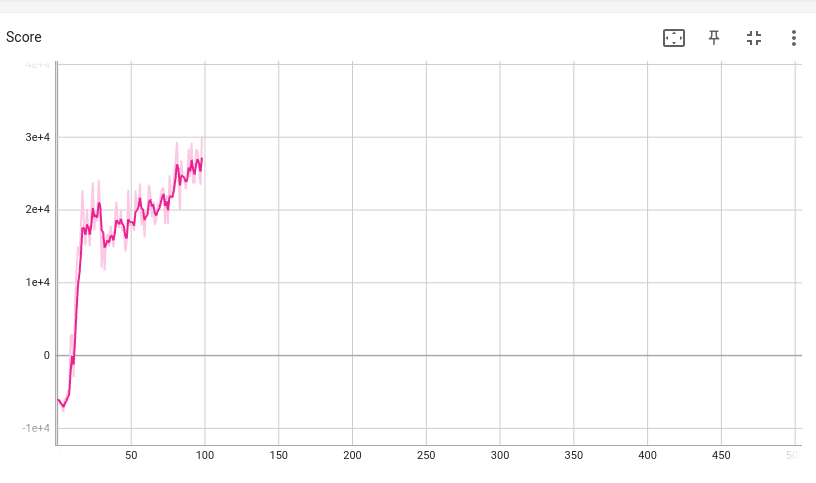

# Autonomous driving through Deep Reinforcement Learning
This repository implements a mobile robot trained through SAC algorithm. 

The mobile robot is designed and simulated in Gazebo 3D Simulator and ROS.

# Requirements
* updating...

# Train

